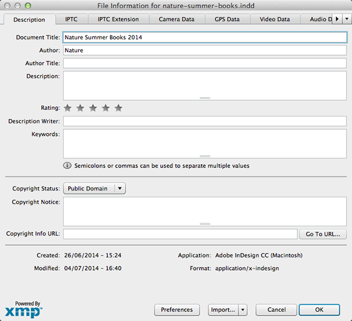
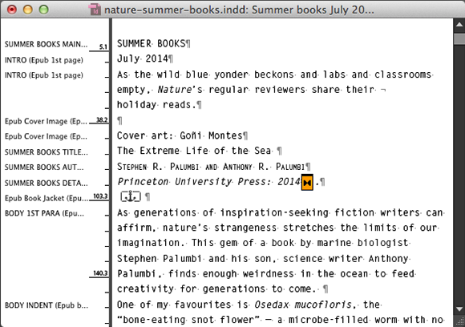
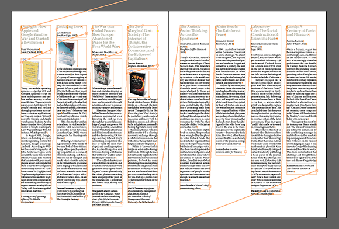
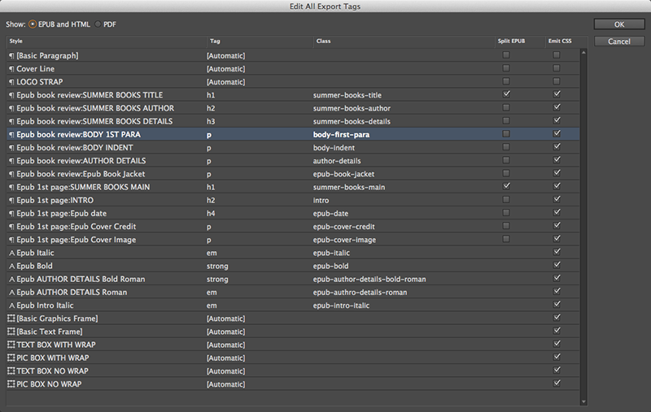
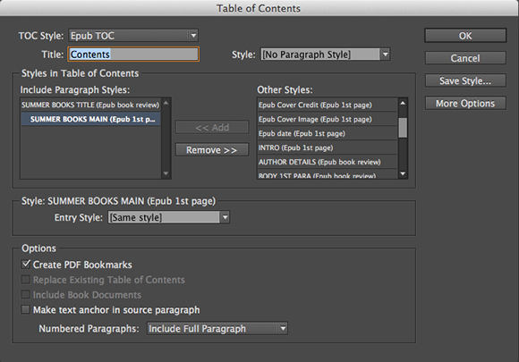
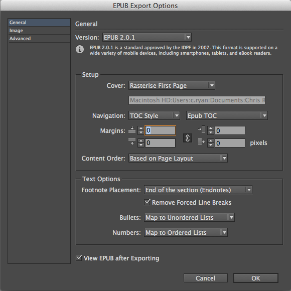
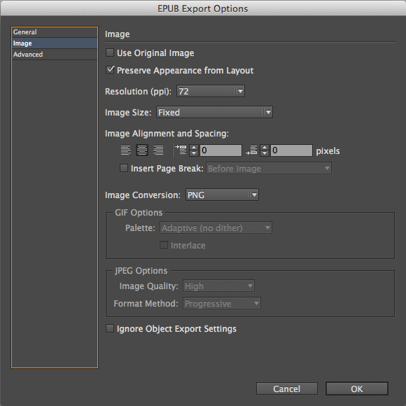
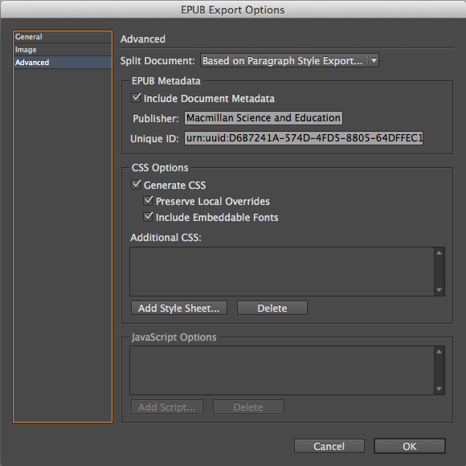

# Nature InDesign to Epub production process

*	
*	
*	
*	
*	
*	
*	
*	
*	
*	
*	
*	
*	
*	
*	
*	

## Set up InDesign file(s)

Use InDesign CC rather than CS5. Adobe have made many improvements to the epub export in the latest version of InDesign.

### File info

In the top menu bar select **file > file info...** to add a Document Title and Author to the document's File Information panel. This information will then be added to the epub's metadata on export. 

You can add some extra information if you like, but without a Document Title and Author the epub will be invalid.

### Images

Remove capitals, punctuation and spaces from all image file names and then re-link the images in the InDesign links panel.

### Cover

Prepare the cover in a separate InDesign document then place it as image on the first page of your document. This picture box should be the only item on page 1.

### Page furniture

Delete or move to a hidden layer all page furniture such as folios and column rules.

### Document flow

Link all text boxes and insert all images into the text at the position you would like them to appear. All text, including headlines, and images should be included in one long InDesign 'story'. You can check this by selecting **Edit > Edit in Story Editor**. Don't worry about the InCopy notes, these won't be exported.

### Paragraph Styles

All text formatting should be applied via Paragraph Styles.

### Bold and italic text

Create character styles for bold and italic text. Remove all manual overrides from the text and apply character styles where bold or italic text is required.

### Export tags

Click on the dropdown menu in the top right corner of the Paragraph Styles window and select **Edit All Export Tags...**. Here you can specify how the styles will be converted into HTML and CSS.

Specify which tags should be applied to each of your styles. 
Generally all headlines should be <code>h1</code>, subheads <code>h2</code>, <code>h3</code>, <code>h4</code> etc... in decending order of importance and all body copy <code>p</code> tags. Italic Character Styles should be <code>em</code> and bold Character Styles <code>strong</code>.

Select **Split EPUB** for all of the headline Paragraph Styles so that these will start on a new page within the epub.

### Table of contents

To create an index/table of contents for the epub select **Layout > Table of Contents**. In the resulting dialogue box select each of your headline Paragraph Styles and click **<<< Add** so that they appear in the **Include Paragraph Styles** list.

Click on **Save Style** and give your Table of Contents style a name. Here I have chosen 'Epub TOC'.

When you click OK InDesign will give you a cursor loaded with the resulting TOC text. Drop this onto the pasteboard and then delete it. The TOC Style needs to be created and saved within the document but should not appear on page.

### Export options

You are now ready to export your epub! Select **File > Export..** as normal and choose **EPUB** as the format. You'll then need to tweak each panel of the Export Options dialogue box.  

**General**
*   Version 2.0.1
*   Cover: Rasterise First Page
*   Navigation TOC Style then select your Table of contents style

**Image**
*   iBooks specify PNG images

**Advanced**
*   Split Document: Based on Paragraph Style Export...
*   Include Document Metadata
*   Add a Publisher
*   Keep the automatically generated Unique ID
*	Generate CSS and Include Embeddable Fonts - This will also encrypt the font files

## Preview the Epub

You can transfer the file to a tablet device, open the epub in iBooks on a mac or [Calibre](http://calibre-ebook.com/) or install the [Firefox EpubReader](https://addons.mozilla.org/en-US/firefox/addon/epubreader/) plugin.

## Post export editing

There are a number of applications available to directly edit epub files such as [Oxygen xml editor](http://www.oxygenxml.com/xml_editor/epub.html) and [Sigil](https://code.google.com/p/sigil/).

Otherwise you can visit the [Mobileread forum](http://www.mobileread.com/forums/showpost.php?p=581649&postcount=1) to download two Apple Script applications for zipping and unzipping epub files.

Once unzipped the epub documents can be edited in any text or HTML editor.

### Amend CSS

Although it is helpful to allow InDesign to generate CSS - because InDesign then handles the embedding and encryption of font files - you'll probably want to amend/remove most of the CSS.

The CSS file is located in **OEBPS > css > idGeneratedStyles.css**.

It is considered a best practice to only apply a light dusting of CSS because readers expect to be able to choose their own fonts, sizes, alignment, hyphenation etc.

You should generally only apply custom styles to headings.

Most epub readers will ignore styles applied to <code>p</code> tags.

It's probably best to not alter any of the <code>@font-face</code> rules. If you do, be sure to update the **content.opf** file as well. 

If you add a new font at this stage you will need to convert it from Open Type to True Type.

There is an example CSS file in the **sample_css** folder.

## Validate the final epub file

Once re-zipped you should test or 'validate' your epub file to expose any errors that might cause it to not work properly.

You can use the International Digital Publishing Forum's [online tool](http://validator.idpf.org/) or download the [EPUB-Checker app](http://www.pagina-online.de/produkte/epub-checker/).

The most thorough and up to date validation is provided by the International Digital Publishing Forum's [EpubCheck](https://github.com/IDPF/epubcheck/releases) command-line tool.

To run EpubCheck you need Java Runtime 1.5 or above (you will probably have this if you are working on an mac). Open terminal and navigate to the EpubCheck folder then run:

	java -jar epubcheck.jar <~filepath/filename.epub>
	

## Create a mobi file for Kindle devices 

A valid Epub 2.0 file can easily be converted to a mobi file. Amazon offer two options. Either download the [Kindle Previewer app](http://www.amazon.com/gp/feature.html/?docId=1000765261) or the [KindleGen](http://www.amazon.com/gp/feature.html?docId=1000765211) command-line tool.

Opening an Epub in the Previewer app will automatically generate a mobi file. The KindleGen command-line tool is configurable and will give you a breakdown of any errors and warnings.

Assuming the KindleGen folder is in your Applications folder, run this command from terminal:

	/Applications/KindleGen_Mac_i386_v2_9/kindlegen <~filepath/filename.epub>

